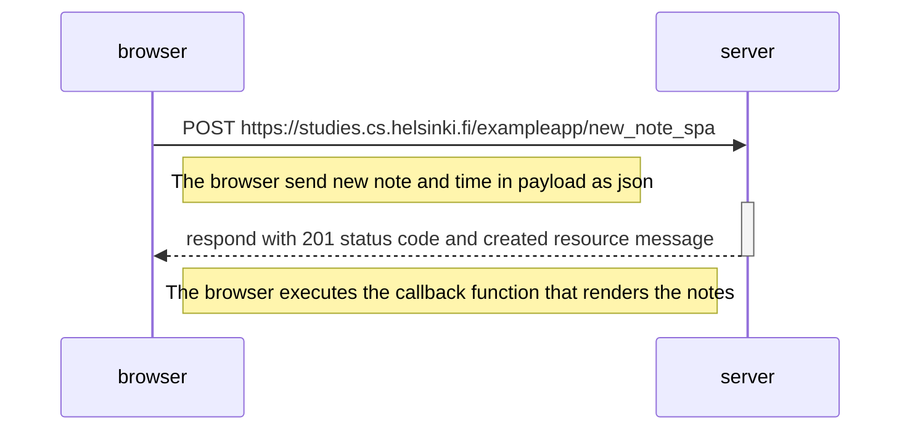

```mermaid
sequenceDiagram
participant browser
participant server

    browser->>server: POST https://studies.cs.helsinki.fi/exampleapp/new_note_spa

    Note right of browser: The browser send new note and time in payload as json
    activate server
    server-->>browser: respond with 201 status code and created resource message 
    deactivate server

    Note right of browser: The browser executes the callback function that renders the notes
```
